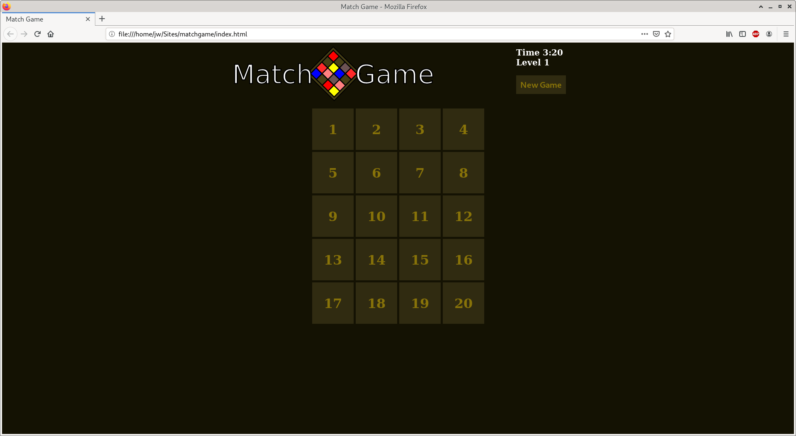

# Match Game

An experimental game I'm building in vanilla HTML, CSS, and Javascript while learning front end web development. Right now I'm building out the UI before moving on to the programming logic.

The end goal is to have several match game themes to choose from with the option to do a timed match, create levels that become increasingly short in game duration, etc. The first match game I'm working on is to match the logos of several technologies I'm learning or find interesting.

If you were to build such a game, what would your favorite theme be?

