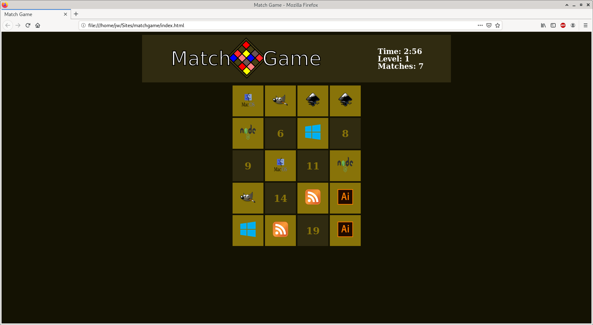

# Match Game

An experimental game I'm building in vanilla HTML, CSS, and Javascript while learning front end web development. A playable version is available! [Play it now](https://jsnwte.github.io/matchgame).

This match game has different themes to choose from with 10 levels that become increasingly short in game duration. If you were to build such a game, what would your favorite theme be?

Check back to see updates as they are published.

